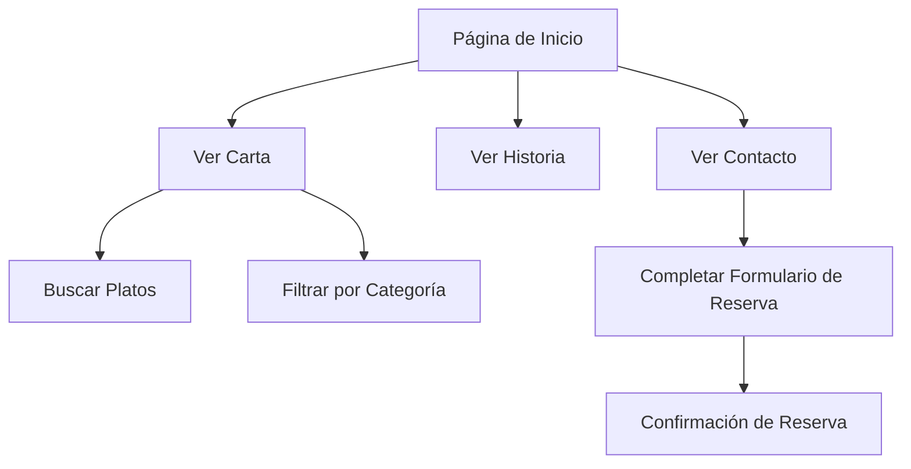

## 1. Product Overview

Bulbit es un restaurante de BBQ coreano que necesita un sitio web moderno y responsivo para mostrar su experiencia culinaria única. El sitio web servirá como la principal herramienta de marketing y reservas del restaurante, permitiendo a los clientes explorar el menú, conocer la historia del establecimiento y realizar reservas.

El producto está dirigido a amantes de la comida coreana, turistas y locales que buscan una experiencia gastronómica auténtica. El sitio web ayudará a aumentar la visibilidad del restaurante, facilitar reservas y mejorar la experiencia del cliente.

## 2. Core Features

### 2.1 User Roles

| Role | Registration Method | Core Permissions |
|------|---------------------|------------------|
| Visitante | Sin registro | Navegar por todas las páginas, ver menú, realizar reservas |
| Administrador | Login seguro | Actualizar menú, gestionar reservas, modificar contenido |

### 2.2 Feature Module

El sitio web de Bulbit consta de las siguientes páginas principales:

1. **Página de Inicio**: Hero section con imagen de BBQ, sección de platos especiales, banner promocional, navegación principal.
2. **Carta Interactiva**: Búsqueda de platos, categorías de menú (Carnes, Acompañamientos, Tradicionales), tarjetas de productos con precios y badges.
3. **Nuestra Historia**: Hero con imagen de parrilla, contenido sobre tradición e innovación, grid de valores, sección de técnica.
4. **Ubicación y Contacto**: Información de contacto, formulario de reservas, mapa interactivo, horarios de atención.

### 2.3 Page Details

| Page Name | Module Name | Feature description |
|-----------|-------------|---------------------|
| Página de Inicio | Hero Section | Mostrar imagen de BBQ con overlay oscuro, título principal "Sabor Coreano Tradicional con un Toque Moderno", botón "Ver la Carta" con icono de libro |
| Página de Inicio | Platos Especiales | Grid de 2 columnas con tarjetas de productos destacados, mostrar nombre del plato, descripción breve y precio |
| Página de Inicio | Banner Promocional | Sección destacada para reservas grupales con botón de acción "Reserva tu mesa ahora" |
| Carta Interactiva | Barra de Búsqueda | Campo de búsqueda con placeholder "Buscar plato..." y icono de lupa |
| Carta Interactiva | Categorías de Menú | Tabs navegables para Carnes, Acompañamientos y Tradicionales con estilo pill |
| Carta Interactiva | Tarjetas de Productos | Mostrar imagen del plato, nombre, descripción, precio en rojo, badges (POPULAR, NATURAL, CHEF'S SPECIAL), botón "+ Añadir" |
| Carta Interactiva | Carousel Acompañamientos | Chips horizontales deslizables con acompañamientos incluidos |
| Nuestra Historia | Hero Section | Imagen de parrilla con overlay, título "Nuestra Historia", etiqueta "BULBIT EXPERIENCE" |
| Nuestra Historia | Contenido Principal | Secciones de texto sobre tradición, ingredientes y técnica del fuego con imágenes |
| Nuestra Historia | Grid de Valores | Grid 2x2 con iconos y descripciones de Tradición, Innovación, Pasión y Comunidad |
| Ubicación y Contacto | Información de Contacto | Tarjetas con dirección, teléfono y horarios de atención |
| Ubicación y Contacto | Formulario de Reservas | Campos para nombre, email, número de comensales, fecha, hora preferida y requisitos especiales |
| Ubicación y Contacto | Mapa Interactivo | Mapa con pin de ubicación y botón para direcciones |
| Navegación Global | Header | Logo Bulbit, menú principal (Home, Menu, History, Contact), botón "Reserve Table" |
| Navegación Global | Bottom Navigation | Barra inferior fija en móvil con iconos para Inicio, Carta, Reservas, Perfil |

## 3. Core Process

### Flujo de Usuario Principal

1. El usuario accede al sitio web a través de la página de inicio
2. Puede navegar entre las diferentes secciones usando el menú principal o la navegación inferior en móvil
3. En la carta, puede buscar platos específicos o explorar por categorías
4. Al encontrar un plato de interés, puede ver detalles y precios
5. Para realizar una reserva, el usuario accede a la página de contacto y completa el formulario
6. El sistema procesa la solicitud de reserva y confirma vía email

## 4. User Interface Design

### 4.1 Design Style

- **Colores Primarios**: Azul profundo (#1F5E85) para CTAs y acentos
- **Colores Secundarios**: Beige/arena (#E7D0A8) para fondos, blanco para tarjetas
- **Colores de Texto**: Azul oscuro para títulos, gris oscuro para contenido
- **Estilo de Botones**: Redondeados con esquinas generosas, fondo sólido azul con texto blanco
- **Tipografía**: Sans-serif redondeada, títulos en negrita, cuerpo en peso normal
- **Iconos**: Estilo outline minimalista en azul
- **Layout**: Basado en tarjetas con sombras suaves y bordes redondeados

### 4.2 Page Design Overview

| Page Name | Module Name | UI Elements |
|-----------|-------------|-------------|
| Página de Inicio | Hero Section | Imagen full-width con gradiente overlay, título grande en blanco, botón primario prominente con icono |
| Página de Inicio | Platos Especiales | Grid responsive de tarjetas con imágenes redondeadas, precios destacados en rojo |
| Carta Interactiva | Tarjetas de Producto | Diseño de tarjeta elevada con imagen superior, badges con bordes finos, botón de añadir azul |
| Nuestra Historia | Grid de Valores | Grid simétrico con fondo azul, iconos blancos minimalistas, texto centrado |
| Ubicación y Contacto | Formulario | Campos redondeados con placeholders descriptivos, botón de envío prominente |

### 4.3 Responsiveness

- **Diseño Desktop-First**: Optimizado para pantallas grandes con layouts de múltiples columnas
- **Adaptación Móvil**: Menú hamburger, navegación inferior fija, tarjetas apiladas verticalmente
- **Puntos de Quiebre**: 768px (tablet), 1024px (desktop)
- **Optimización Táctil**: Botones amplios para fácil interacción en móviles

### 4.4 Interacciones y Transiciones

- **Hover Effects**: Elevación de tarjetas, cambio de color en botones
- **Scroll Animaciones**: Fade-in suave para secciones al hacer scroll
- **Transiciones de Página**: Transiciones suaves entre secciones
- **Loading States**: Skeleton screens para contenido dinámico
- **Microinteracciones**: Feedback visual en botones, iconos animados