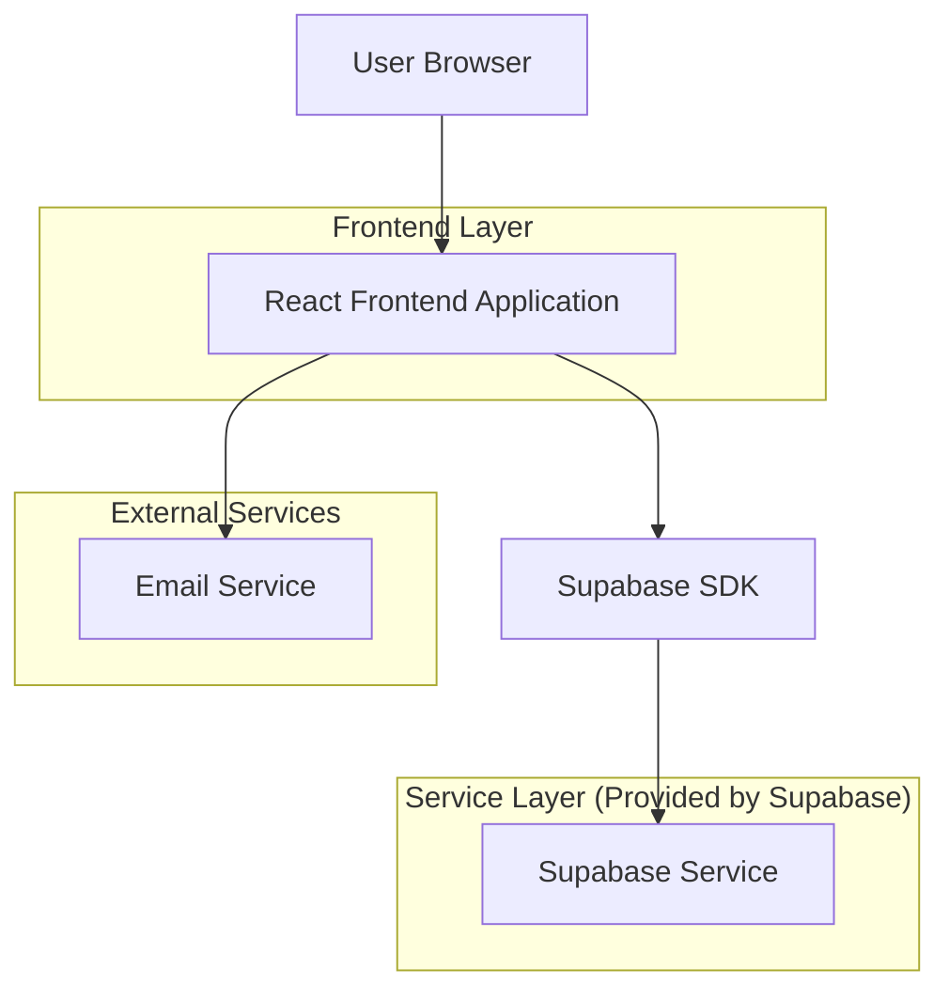
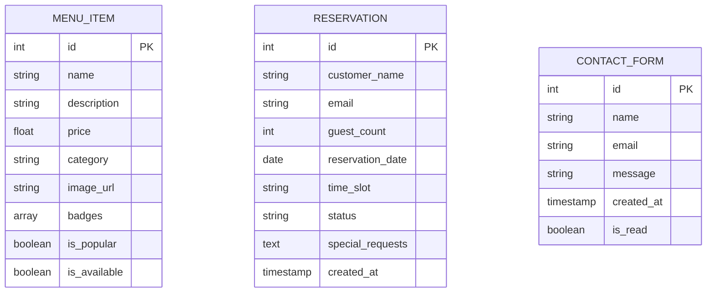

## 1. Architecture design



## 2. Technology Description

- Frontend: React@18 + tailwindcss@3 + vite
- Initialization Tool: vite-init
- Backend: Supabase (PostgreSQL)
- Email Service: Supabase Edge Functions + Resend/SendGrid
- SEO: React Helmet Async + Next.js (si se migra más adelante)

## 3. Route definitions

| Route | Purpose |
|-------|---------|
| / | Página de inicio con hero section y platos especiales |
| /menu | Carta interactiva con búsqueda y categorías de platos |
| /history | Página de historia con contenido sobre tradición y valores |
| /contact | Formulario de contacto y reservas con información de ubicación |
| /reservation | Página dedicada para reservas (redirige desde botones) |

## 4. API definitions

### 4.1 Reservas API

```
POST /api/reservations
```

Request:
| Param Name | Param Type | isRequired | Description |
|------------|-------------|-------------|-------------|
| full_name | string | true | Nombre completo del cliente |
| email | string | true | Email de contacto |
| guests | number | true | Número de comensales |
| date | string | true | Fecha de reserva (YYYY-MM-DD) |
| time_preference | string | true | Preferencia de horario |
| special_requirements | string | false | Requisitos especiales |

Response:
| Param Name | Param Type | Description |
|------------|-------------|-------------|
| success | boolean | Estado de la reserva |
| reservation_id | string | ID único de reserva |
| message | string | Mensaje de confirmación |

Example:
```json
{
  "full_name": "Juan Pérez",
  "email": "juan@email.com",
  "guests": 4,
  "date": "2024-01-15",
  "time_preference": "Lunch (11:30 - 15:00)",
  "special_requirements": "Mesa cerca de la ventana"
}
```

### 4.2 Menú API

```
GET /api/menu
```

Query Parameters:
| Param Name | Param Type | Description |
|------------|-------------|-------------|
| category | string | Filtrar por categoría (carnes, acompañamientos, tradicionales) |
| search | string | Búsqueda de texto |

Response:
| Param Name | Param Type | Description |
|------------|-------------|-------------|
| items | array | Array de objetos de menú |
| total | number | Total de items |

## 5. Data model

### 6.1 Data model definition



### 6.2 Data Definition Language

**Tabla de Items del Menú (menu_items)**
```sql
-- create table
CREATE TABLE menu_items (
    id UUID PRIMARY KEY DEFAULT gen_random_uuid(),
    name VARCHAR(255) NOT NULL,
    description TEXT,
    price DECIMAL(10,2) NOT NULL,
    category VARCHAR(50) NOT NULL CHECK (category IN ('carnes', 'acompañamientos', 'tradicionales')),
    image_url VARCHAR(500),
    badges TEXT[], -- Array de badges como 'POPULAR', 'CHEF_SPECIAL', 'NATURAL'
    is_popular BOOLEAN DEFAULT false,
    is_available BOOLEAN DEFAULT true,
    created_at TIMESTAMP WITH TIME ZONE DEFAULT NOW(),
    updated_at TIMESTAMP WITH TIME ZONE DEFAULT NOW()
);

-- create indexes
CREATE INDEX idx_menu_items_category ON menu_items(category);
CREATE INDEX idx_menu_items_popular ON menu_items(is_popular);
CREATE INDEX idx_menu_items_available ON menu_items(is_available);

-- grant permissions
GRANT SELECT ON menu_items TO anon;
GRANT ALL PRIVILEGES ON menu_items TO authenticated;
```

**Tabla de Reservas (reservations)**
```sql
-- create table
CREATE TABLE reservations (
    id UUID PRIMARY KEY DEFAULT gen_random_uuid(),
    customer_name VARCHAR(255) NOT NULL,
    email VARCHAR(255) NOT NULL,
    guest_count INTEGER NOT NULL CHECK (guest_count > 0 AND guest_count <= 20),
    reservation_date DATE NOT NULL,
    time_slot VARCHAR(100) NOT NULL,
    status VARCHAR(20) DEFAULT 'pending' CHECK (status IN ('pending', 'confirmed', 'cancelled')),
    special_requests TEXT,
    created_at TIMESTAMP WITH TIME ZONE DEFAULT NOW(),
    updated_at TIMESTAMP WITH TIME ZONE DEFAULT NOW()
);

-- create indexes
CREATE INDEX idx_reservations_date ON reservations(reservation_date);
CREATE INDEX idx_reservations_email ON reservations(email);
CREATE INDEX idx_reservations_status ON reservations(status);

-- grant permissions
GRANT SELECT, INSERT ON reservations TO anon;
GRANT ALL PRIVILEGES ON reservations TO authenticated;
```

**Tabla de Formularios de Contacto (contact_forms)**
```sql
-- create table
CREATE TABLE contact_forms (
    id UUID PRIMARY KEY DEFAULT gen_random_uuid(),
    name VARCHAR(255) NOT NULL,
    email VARCHAR(255) NOT NULL,
    message TEXT NOT NULL,
    is_read BOOLEAN DEFAULT false,
    created_at TIMESTAMP WITH TIME ZONE DEFAULT NOW()
);

-- create indexes
CREATE INDEX idx_contact_forms_email ON contact_forms(email);
CREATE INDEX idx_contact_forms_read ON contact_forms(is_read);

-- grant permissions
GRANT SELECT, INSERT ON contact_forms TO anon;
GRANT ALL PRIVILEGES ON contact_forms TO authenticated;
```

## 6. SEO Configuration

### 6.1 Meta Tags Dinámicos
- Títulos únicos por página con estructura "[Página] | Bulbit Korean BBQ"
- Descripciones meta optimizadas para cada sección
- Open Graph tags para redes sociales
- Schema.org markup para restaurante local

### 6.2 Performance Optimization
- Lazy loading para imágenes
- Code splitting por rutas
- Optimización de imágenes WebP
- Caching estratégico de contenido estático

### 6.3 Accesibilidad
- ARIA labels apropiados
- Navegación por teclado
- Contraste de color WCAG 2.1 AA
- Screen reader friendly markup